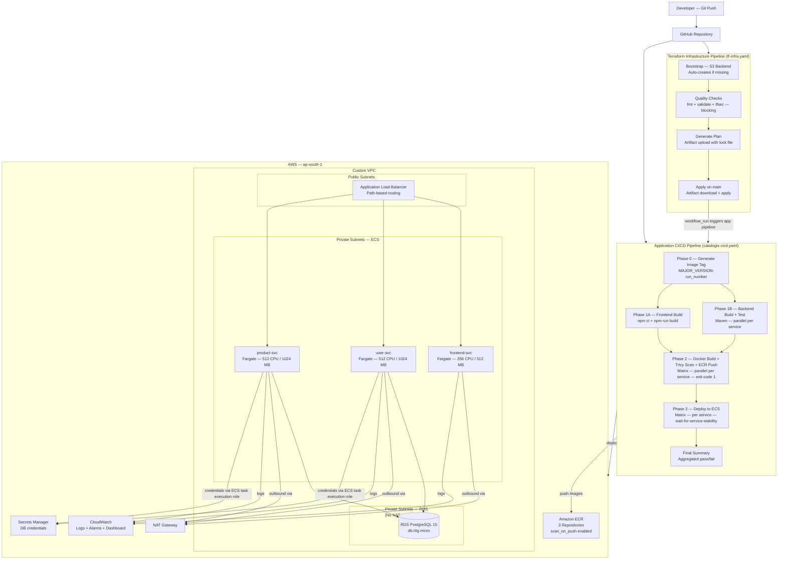

# Cloud-Native Infrastructure Automation & Containerized Deployment on AWS

**GitHub Actions · Terraform · Docker · AWS · tfsec · Trivy**

---

This project provisions and operates a complete cloud-native platform on AWS for a containerized, three-service application deployed on Amazon ECS Fargate. The focus is on **infrastructure design, CI/CD automation, DevSecOps integration, and operational observability** — not application business logic.

The application — *Catalogix*, a product catalog with user management — is intentionally simple to keep the focus on how services are built, secured, deployed, and monitored.

---

## Project Goals

This project was built to demonstrate:

- End-to-end infrastructure provisioning using Terraform
- Running multiple services on ECS Fargate (serverless containers)
- Secure CI/CD pipelines using GitHub Actions
- DevSecOps practices including vulnerability and IaC scanning
- Production-aligned networking and security design
- Clear separation of infrastructure, deployment, and application concerns
- Design decisions and trade-offs commonly made in real-world systems

---

## Project Overview

The platform provisions a complete AWS environment capable of running multiple services:

### Services

- Frontend service (React + Nginx)
- Backend services (Spring Boot – User & Product)

### Platform Components

- Managed database (Amazon RDS PostgreSQL)
- Container runtime (Amazon ECS Fargate)
- Container registry (Amazon ECR)
- Traffic routing (Application Load Balancer)
- Secure credentials (AWS Secrets Manager)
- Observability (CloudWatch Logs and Alarms)
- CI/CD automation (GitHub Actions)
- Infrastructure as Code (Terraform)

The current implementation targets a development environment, with the repository structured to support future environments (staging / production).

---

## Architecture Overview

### High-Level Architecture



### Request flow:
```
Client
  ↓
Application Load Balancer
  ↓
ECS Fargate Services (Frontend / Backend) (Private Subnets)
  ↓
Amazon RDS PostgreSQL (Private subnets)
```

### Key characteristics:

- ALB runs in public subnets.
- ECS services run in private subnets.
- NAT Gateway provides outbound internet access.
- RDS is isolated in private DB subnets, not publicly accessible.
- Services communicate via internal networking.
- Health checks ensure traffic reaches only healthy tasks.

### Architecture Diagrams

#### Diagram: High-Level AWS Architecture

##### Components to include:

- VPC
- Public Subnets → ALB
- Private Subnets → ECS Tasks
- RDS in private subnets
- ECR
- CloudWatch
- Secrets Manager

##### Explanation (AWS Architecture)

- Client traffic enters through an Application Load Balancer.  
- The ALB routes requests to ECS services running on Fargate in private subnets via NAT Gateway for outbound access.
- Services pull container images from ECR via NAT Gateway and store data in RDS.  
- Logs are shipped to CloudWatch.

##### Explanation (CI/CD Pipeline)

- Each commit triggers a GitHub Actions workflow.  
- The pipeline builds Docker images, pushes them to ECR, and updates ECS services using new task definitions.
- IAM user is used for authentication.

---

### Networking & Security Architecture

#### Network Design

- Custom VPC with CIDR planning
- Public subnets → ALB
- Private app subnets → ECS tasks
- Private DB subnets → RDS
- NAT Gateway for secure outbound traffic
- Internet Gateway for inbound ALB traffic

#### Security Controls

- Least-privilege IAM roles
- ECS accessible only via ALB
- RDS accessible only from ECS
- No public database exposure
- Secrets stored in AWS Secrets Manager
- Private workloads with controlled ingress

---

### AWS Infrastructure

Provisioned using Terraform.

#### Compute & Containers

- ECS Cluster (Fargate)
- Service-per-microservice architecture
- Target groups & health checks
- Rolling deployments

#### Database

- Amazon RDS PostgreSQL
- Private subnets only
- Security group isolation
- Credentials stored in Secrets Manager

#### Observability

- CloudWatch log groups per service
- ECS CPU alarms
- ALB health alarms
- Metrics dashboard

---

### 📦 Infrastructure as Code (Terraform)

Terraform provisions:

- VPC & networking
- ECS cluster & services
- ALB & routing
- RDS database
- IAM roles & policies
- ECR repositories
- CloudWatch monitoring
- Secrets Manager

#### Terraform Pipeline Highlights

- Remote state bootstrap (S3 backend)
- Security scanning via tfsec
- Automated plan & apply workflow
- Environment-ready structure
- Re-usable composite GitHub Action

---

### 🔑 Secrets Management

Database credentials are stored in AWS Secrets Manager.

ECS tasks retrieve credentials via IAM roles.

No secrets are stored in source code or environment files.

---

### Monitoring and Observability

CloudWatch provides

- Container logs
- ECS CPU Alarms
- Metrics dashboards
- ALB health alarms

Logs enable rapid debugging and operational visibility.

---

## 📂 Repository Structure

```
aws-serverless-platform-iac/
│
├── .github/
│   ├── workflows/
│   │   ├── catalogix-cicd.yaml     # Application CI/CD — matrix build, scan, deploy
│   │   ├── tf-infra.yaml           # Infrastructure pipeline — bootstrap, quality, plan, apply
│   │   └── tf-destroy.yaml         # Manual-only destroy workflow (workflow_dispatch)
│   └── actions/
│       └── terraform-setup/
│           └── action.yaml         # Composite action — AWS credentials + Terraform setup
│
├── user-svc/                       # Spring Boot user management service (port 8081)
│   ├── src/
│   └── Dockerfile
│
├── product-svc/                    # Spring Boot product catalog service (port 8082)
│   ├── src/
│   └── Dockerfile
│
├── frontend-svc/                   # React + Nginx frontend (port 80)
│   ├── src/
│   └── Dockerfile
│
├── terraform/
│   ├── terraform-backend/          # S3 + KMS — apply once before main infra
│   └── envs/dev/                   # Development environment — flat files, no modules
│       ├── networking.tf           # VPC, 3 subnet tiers, IGW, NAT, route tables
│       ├── security-groups.tf      # ALB SG, ECS SG, RDS SG
│       ├── alb.tf                  # ALB, HTTP listener, path-based listener rules, target groups
│       ├── ecs.tf                  # ECS cluster, task definitions, services
│       ├── ecr.tf                  # ECR repositories, scan_on_push, lifecycle policy
│       ├── rds.tf                  # RDS PostgreSQL 15, db.t4g.micro
│       ├── secrets.tf              # Secrets Manager secret for DB credentials
│       ├── iam.tf                  # ECS execution role, ECS task role
│       ├── cloudwatch.tf           # Log groups, CPU/memory/ALB alarms, dashboard
│       ├── autoscaling.tf          # App autoscaling — CPU + memory target tracking per service
│       ├── outputs.tf
│       ├── variables.tf
│       └── providers.tf
│
└── pom.xml                         # Parent POM for Maven multi-module build
```

Terraform modules were intentionally avoided to keep the infrastructure explicit and reviewable.

---

## CI/CD Pipeline — Application Delivery (`catalogix-cicd.yaml`)

### Trigger Logic

The application pipeline triggers on three conditions:
- `push` to `main` — but only when files under `user-svc/`, `product-svc/`, `frontend-svc/`, or the pipeline file itself are changed (path filters prevent unnecessary runs on unrelated commits)
- `workflow_run` — automatically after the Terraform Infrastructure pipeline completes successfully on `main`, so a fresh infrastructure deployment is immediately followed by an application deployment
- `workflow_dispatch` — manual trigger

`concurrency: group: catalogix-main, cancel-in-progress: true` ensures that if a new commit arrives while a pipeline is running, the in-progress run is cancelled and only the latest commit is deployed.

### Pipeline Phases

```
Phase 0 — Pipeline Context (runs once)
  └── Generate image tag: MAJOR_VERSION-github.run_number
      └── Passed as output to all downstream jobs

Phase 1A — Frontend Build (matrix: frontend-svc)
  └── npm ci + npm run build
  └── Node.js 22, npm cache keyed to package-lock.json

Phase 1B — Backend Build + Test (matrix: user-svc, product-svc — parallel)
  └── mvn -B install -N (parent POM, no submodules)
  └── mvn -B -f <service>/pom.xml clean verify (unit + integration tests)

Phase 2 — Docker Build + Trivy Scan + ECR Push (matrix: all 3 services — parallel)
  └── docker build --pull
      --cache-from ECR cache layer
      --build-arg BUILDKIT_INLINE_CACHE=1
  └── Trivy image scan — CRITICAL,HIGH — ignore-unfixed — exit-code 1
  └── docker push (only if Trivy passes)

Phase 3 — Deploy to ECS (matrix: all 3 services — parallel)
  └── Download current task definition from ECS
  └── Render new task definition with updated image tag
  └── Deploy + wait-for-service-stability

Final Summary (always runs)
  └── Aggregated pass/fail across all matrix jobs
  └── Exits non-zero if any phase failed
```

### Key Pipeline Decisions

**Matrix jobs for homogeneous service operations.** Phases 1B, 2, and 3 all use `strategy.matrix` over the list of services. Adding a fourth service requires adding one entry to the matrix — no pipeline duplication. `fail-fast: true` on the build matrix means if one service fails to build, the other builds are cancelled immediately rather than continuing to consume runner minutes.

**Build cache from ECR.** The Docker build step uses `--cache-from` pointing to an existing ECR cache layer and `--build-arg BUILDKIT_INLINE_CACHE=1` to embed cache metadata in the pushed image. This means subsequent builds reuse unchanged layers from ECR instead of rebuilding from scratch, reducing build time especially for Maven dependency resolution.

**Trivy runs before ECR push — not after.** The `aquasecurity/trivy-action` step runs in the same matrix job as the build, before `docker push`. If a CRITICAL or HIGH vulnerability is found, the image is never pushed to ECR. ECR also has `scan_on_push = true` configured in Terraform as a secondary scan layer, but the primary gate is the pre-push Trivy check.

**Image tag generated once in Phase 0 and passed via job outputs.** If each job generated its own tag independently, different phases could produce different tags for the same commit under certain conditions. A single `context` job generates `MAJOR_VERSION-${{ github.run_number }}` and all downstream jobs reference `${{ needs.context.outputs.image_tag }}`.

**`wait-for-service-stability: true` in ECS deployment.** The GitHub Actions ECS deploy step waits for the ECS service to report stable before the pipeline job completes. This means the pipeline does not report success until ECS has confirmed that the new task definition is running and healthy targets exist in the ALB target group.

**Pipeline chaining via `workflow_run`.** The app pipeline watches for completion of the Terraform Infrastructure pipeline via the `workflow_run` trigger with `conclusion == 'success'`. This creates a dependency: infrastructure changes are applied first, then the application is deployed automatically on the same commit. Without this, an infra change and an app change landing simultaneously could deploy the app before infra was ready.

---

## Infrastructure Pipeline (`tf-infra.yaml`)

Four sequential jobs protect infrastructure changes from being applied carelessly.

```
Bootstrap
  └── Check if S3 backend bucket exists (aws s3api head-bucket)
  └── If missing: terraform init + terraform apply in terraform-backend/
  └── S3 bucket is protected — force_destroy = false, public access fully blocked,
      versioning enabled, SSE with Customer Managed KMS key

Quality Checks
  └── terraform init
  └── terraform fmt -check -recursive  (fails if any file is not properly formatted)
  └── terraform validate
  └── tfsec — soft_fail: false (blocking — any tfsec finding fails the pipeline)

Plan
  └── terraform plan -out main.tfplan
  └── Upload artifact: main.tfplan + .terraform.lock.hcl
      (lock file included to guarantee the same provider versions are used in apply)

Deploy (main branch only)
  └── Download artifact
  └── terraform init -input=false
  └── terraform apply --auto-approve main.tfplan
```

**There is also a separate `tf-destroy.yaml` workflow** triggered only by `workflow_dispatch` (manual). It runs `terraform destroy -auto-approve` and is intentionally not triggered by any push or schedule. This acts as a safety gate — destroying infrastructure always requires a deliberate manual action in the GitHub UI.

The **composite action** (terraform-setup/action.yaml) is called by every job in the Terraform infrastructure pipeline (tf-infra.yaml) to configure AWS credentials and set up Terraform. The application pipeline (catalogix-cicd.yaml) calls aws-actions/configure-aws-credentials directly in the jobs that need it and does not use this composite action. The composite action accepts an enable_terraform flag (default: true) so jobs that only need AWS credentials — not Terraform — can set enable_terraform: false without duplicating the AWS credentials setup. concurrency: group: terraform-dev on the infra pipeline ensures two infra runs never execute simultaneously.

---

## Infrastructure Design

All infrastructure for this project is written as flat Terraform files with no modules. Module abstraction was intentionally avoided to keep all resource relationships visible in one place and to make the code easier to trace during review. A change to the ECS task definition is in `ecs.tf`. The security group that controls what can reach it is in `security-groups.tf`. The IAM role it uses is in `iam.tf`. Nothing is hidden inside a module.

### Networking (`networking.tf`)

Three distinct subnet tiers in the VPC:

**Public subnets** — ALB lives here. Internet Gateway provides inbound access. `map_public_ip_on_launch = true` for ALB.

**Private ECS subnets** — Fargate tasks run here. NAT Gateway provides outbound access for ECR image pulls and Secrets Manager calls. ECS tasks have `assign_public_ip = false`.

**Private RDS subnets** — RDS lives here with its own route table that has no default route — not even to the NAT Gateway. The only path into this subnet is via the RDS security group rule that allows port 5432 from the ECS security group. Restricting routing at the subnet level is an additional layer of isolation beyond just the security group.

Subnet CIDRs are computed dynamically with `cidrsubnet(var.vpc_cidr, 4, index)`. Public subnets use offsets 0–1, ECS private subnets use offsets 4–5, RDS private subnets use offsets 8–9. This keeps the CIDR plan readable and avoids overlap.

### ECS Task Definitions (`ecs.tf`)

Each service has its own task definition with separately sized resources:

| Service | CPU | Memory | Port |
|---|---|---|---|
| frontend-svc | 256 | 512 MB | 80 |
| user-svc | 512 | 1024 MB | 8081 |
| product-svc | 512 | 1024 MB | 8082 |

Backend services receive DB credentials via the ECS `secrets` block, not environment variables. The `valueFrom` field references the Secrets Manager secret ARN directly:

```hcl
secrets = [
  {
    name      = "SPRING_DATASOURCE_USERNAME"
    valueFrom = "${aws_secretsmanager_secret.db_credentials.arn}:username::"
  },
  {
    name      = "SPRING_DATASOURCE_PASSWORD"
    valueFrom = "${aws_secretsmanager_secret.db_credentials.arn}:password::"
  }
]
```

The ECS task execution role has a dedicated inline policy granting `secretsmanager:GetSecretValue` scoped to only the DB credentials secret ARN. The credential values are injected at container startup by the ECS agent, not stored anywhere in the task definition or environment.

**All three ECS services have `lifecycle { ignore_changes = [task_definition, desired_count] }`**. Without this, every `terraform apply` after the first deployment would try to revert the task definition back to the `init` image tag that was hardcoded at resource creation time. The CI/CD pipeline owns the task definition after initial provisioning — Terraform should not fight it.

**Backend services have `health_check_grace_period_seconds = 90`**. The JVM takes significantly longer to start than the ALB health check interval. Without the grace period, ECS registers the task with the ALB before the Spring Boot application is ready to serve requests, the health check fails, and ECS kills and restarts the task in a loop. 90 seconds covers the full JVM startup + Spring context initialization.

**CloudWatch log driver uses `mode = "non-blocking"` with `max-buffer-size = "25m"`**. In blocking mode, if CloudWatch Logs is temporarily unavailable or experiencing throttling, the container's logging calls block — which can cause the application to hang. Non-blocking mode writes to a 25 MB in-memory buffer. If the buffer fills, log entries are dropped rather than blocking the process.

### ALB and Path-Based Routing (`alb.tf`)

A single ALB in public subnets routes to all three services using listener rule priorities:

- Priority 10: `/users*` and `/users/*` → user-svc target group (port 8081)
- Priority 20: `/products*` and `/products/*` → product-svc target group (port 8082)
- Default action: all other traffic → frontend-svc target group (port 80)

Target type is `ip` (required for Fargate — Fargate tasks do not register with EC2 instance IDs).

**The `/actuator/*` path pattern was added to the user-svc and product-svc listener rules.** During initial testing, ALB health checks were failing because the health check path (`/health`) was routed to the frontend target group by the default rule, not to the backend services. Adding `/actuator/*` to the backend listener rules ensures health check traffic reaches the correct service.

Both backend target groups have `lifecycle { create_before_destroy = true }` to prevent downtime during target group replacements. If a target group needs to be recreated, the new one is created first, traffic is shifted, and the old one is destroyed.

### ECR Repositories (`ecr.tf`)

Each service has a dedicated ECR repository with:
- `scan_on_push = true` — ECR runs its own vulnerability scan on every image push, independent of the Trivy scan in the pipeline
- ECR lifecycle policy keeping the last 10 images. Older images are expired automatically to control storage costs
- `force_delete = true` — allows the repository to be deleted with images still in it during `terraform destroy`. This is appropriate for development and explicitly commented as not suitable for production

The lifecycle policy JSON is defined once in a `local` and referenced by all three repository resources to avoid copying the same JSON block three times.

### Secrets Management (`secrets.tf`)

DB credentials are stored in Secrets Manager under `${project_name}/database-credentials`. `recovery_window_in_days = 0` is set so the secret is deleted immediately on `terraform destroy` rather than being retained for 30 days — appropriate for a development environment where re-provisioning is expected.

### Autoscaling (`autoscaling.tf`)

Application autoscaling uses target tracking policies for both CPU and memory on all three services:
- CPU target: 70% — scale out when average CPU across tasks exceeds 70%
- Memory target: 75%
- Minimum tasks: 1, Maximum tasks: 2 per service
- Scale-out cooldown: 60 seconds (add capacity quickly under load)
- Scale-in cooldown: 300 seconds (wait 5 minutes before removing capacity to avoid flapping)

All three services and their autoscaling configurations are defined in a single `local` map (`autoscaling_config`). The `aws_appautoscaling_target` and `aws_appautoscaling_policy` resources use `for_each` over this map. Adding autoscaling for a new service requires only one entry in the map.

### Terraform Backend (`terraform-backend/`)

The S3 backend uses a Customer Managed KMS key (CMK) for server-side encryption instead of the default SSE-S3. The distinction: with SSE-S3, AWS manages the encryption key and any AWS employee or process with S3 access can theoretically decrypt the data. With CMK, the key is in your AWS account and you control who can use it. KMS key usage is also logged to CloudTrail.

The S3 bucket has:
- Versioning enabled — previous Terraform state versions are retained and recoverable
- All public access blocked (four separate settings)
- `force_destroy = false` — the bucket cannot be deleted by Terraform unless explicitly overridden, protecting against accidental state loss

### CloudWatch Monitoring (`cloudwatch.tf`)

Log groups are defined with 7-day retention. All CloudWatch configuration — log groups, alarms, and the dashboard — is provisioned by Terraform as code, not configured manually in the console.

Three categories of alarms:
- **ECS CPU alarms** — triggers when average CPU exceeds 80% across 2 consecutive 60-second periods, per service
- **ECS memory alarms** — same threshold and evaluation window, for memory
- **ALB UnhealthyHostCount alarms** — triggers when any target group reports 1 or more unhealthy hosts, evaluated over 2 periods

Both ECS alarms and ALB alarms use `for_each` over `local` maps (`ecs_services`, `target_groups`). All 9 alarms (3 CPU + 3 memory + 3 ALB) are generated from 2 resource blocks (`ecs_cpu_high`, `ecs_memory_high`, `alb_unhealthy_hosts`) — not 9 separate resource definitions.

The CloudWatch dashboard is also defined in Terraform (`aws_cloudwatch_dashboard`) with 8 widgets. CPU and memory utilization widgets cover user-svc and product-svc only — the frontend service is stateless and its container metrics are not tracked in this dashboard. The remaining four widgets are ALB-level: request count, target response time, 5XX error count, and unhealthy host count (scoped to the frontend target group). The dashboard is provisioned and updated by terraform apply.

---

## Infrastructure Deployment

### Provision Infrastructure

```bash
cd terraform/envs/dev
terraform init
terraform plan
terraform apply
```

---

## Deployment & Rollback Strategy

### Deployment

- ECS services use rolling deployments
- New task definition revisions are registered per deployment
- ALB ensures traffic is routed only to healthy tasks

### Rollback (Conceptual)

- ECS retains previous task definition revisions
- Rollback can be performed by redeploying a previous stable revision
- No additional tooling is required

---

## Testing

- Backend services include basic unit and integration tests
- CI fails fast on build or test errors
- Testing scope kept minimal to emphasize infrastructure & automation

---

## Design Decisions & Trade-offs

Below are the key architectural decisions and the trade-offs behind them.

### 1. ECS Fargate over EC2 / EKS

**Decision**
ECS Fargate was chosen as the container runtime instead of EC2-backed ECS or Kubernetes (EKS).

**Why**

- No node management or AMI lifecycle
- Native AWS integration (ALB, IAM, CloudWatch)
- Faster time-to-production for small teams

**Trade-off**

- Less control over underlying compute
- Vendor lock-in compared to Kubernetes

**Rationale**
For a DevOps-focused platform demonstrating AWS-native design, Fargate offers the best balance between operational simplicity and production realism.

### 2. Single ALB with Path-Based Routing over Per-service ALBs

**Decision**
A single Application Load Balancer routes traffic to multiple services using path-based rules.

**Why**

- Cost-efficient
- Centralized ingress
- Simple to reason about request flow

**Trade-off**

- Shared blast radius if ALB misconfigured
- Less isolation than per-service ALBs

**Rationale**
This reflects a common real-world pattern for early-stage or internal platforms, while remaining extensible for future isolation if required.

### 3. Matrix-Based CI/CD Pipelines

**Decision**
GitHub Actions matrix jobs are used to build, scan, and deploy multiple services in parallel.

**Why**

- Clear per-service isolation
- Faster pipelines through parallelism
- Scales naturally as services are added

**Trade-off**

- Slightly more complex YAML
- Aggregated job status requires careful handling

**Rationale**
This mirrors how modern CI/CD systems handle microservices without duplicating pipeline logic.

### 4. Terraform without Modules (Intentionally)

**Decision**
Terraform modules were intentionally avoided.

**Why**

- Improves readability for reviewers
- Makes resource relationships explicit
- Easier to trace during interviews

**Trade-off**

- Less DRY
- Harder to scale across many environments

**Rationale**
For a learning and portfolio project, transparency was prioritized over abstraction.

### 5. Minimal Application Logic

**Decision**
Application services are intentionally simple.

**Why**

- Keeps focus on infrastructure, CI/CD, and deployment
- Avoids conflating backend engineering with platform engineering

**Trade-off**

- Limited business logic depth

**Rationale**
The project’s goal is to demonstrate how services are built, shipped, and operated, not feature-rich applications.

### 6. Observability as a First-Class Concern

**Decision**
CloudWatch logging is configured per service with defined retention.

**Why**

- Enables debugging and post-deployment visibility
- Avoids silent failures
- Mirrors production expectations

**Trade-off**

- No advanced tracing or metrics dashboards yet

**Rationale**
Logs are the foundational observability layer and are sufficient for this platform’s scope.

### 7. `lifecycle { ignore_changes = [task_definition] }` on ECS Services

Terraform is used to create the ECS infrastructure — cluster, task definitions, services, target groups. After initial creation, the CI/CD pipeline owns the task definition revision. Without `ignore_changes`, every subsequent `terraform apply` would try to revert the running task definition to the original `init` image, conflicting with any running deployments.

### 8. ECR `scan_on_push` + Pipeline Trivy Scan

Both layers are intentionally active. ECR's scan runs after the push, using AWS's managed scanning infrastructure. The pipeline Trivy scan runs before the push and blocks delivery of vulnerable images entirely. The ECR scan serves as an ongoing check against new CVEs that may be disclosed after the image was originally built.

---

## Required GitHub Secrets and Variables

### Secrets
| Secret | Description |
|---|---|
| `AWS_ACCESS_KEY_ID` | IAM user access key |
| `AWS_SECRET_ACCESS_KEY` | IAM user secret key |
| `DB_USERNAME` | RDS master username |
| `DB_PASSWORD` | RDS master password |

### Variables
| Variable | Description |
|---|---|
| `PROJECT_NAME` | Project name prefix for all resources |
| `VPC_CIDR` | VPC CIDR block |
| `PUBLIC_SUBNET_CIDRS` | Public subnet CIDR list |
| `PRIVATE_SUBNET_CIDRS` | Private subnet CIDR list |

---

## Current Scope and Known Limitations

- HTTP only. HTTPS with ACM is documented as a future improvement in the ALB Terraform comments.
- Static IAM credentials. The next improvement is GitHub OIDC authentication to remove long-lived access keys, which is already referenced in the `info` section and pipeline permissions.
- Single NAT Gateway. Cost-appropriate for development; a production setup would use one NAT Gateway per AZ.
- RDS `skip_final_snapshot = true` and `deletion_protection = false`. Both are appropriate for a dev environment where data loss is acceptable.
- No Gitleaks or SonarQube in the application pipeline. Static analysis and secret scanning are present in the companion Jenkins project. Future addition noted.

---

## Future Improvements

- Multi-environment support (staging / production)
- HTTPS with ACM certificate on the ALB listener
- AWS WAF protection
- Blue/green or canary deployments
- GitHub OIDC authentication (remove long-lived access keys)
- Advanced metrics and tracing
- Per-AZ NAT Gateways for production networking
- Gitleaks secret scanning added to the application pipeline
- Terraform modules
- SonarCloud integration (permissions block already includes `pull-requests: write` for SonarCloud PR comments)

Notes

Terraform modules were intentionally avoided to keep infrastructure readable and traceable for learning and review purposes. Will introduce later.