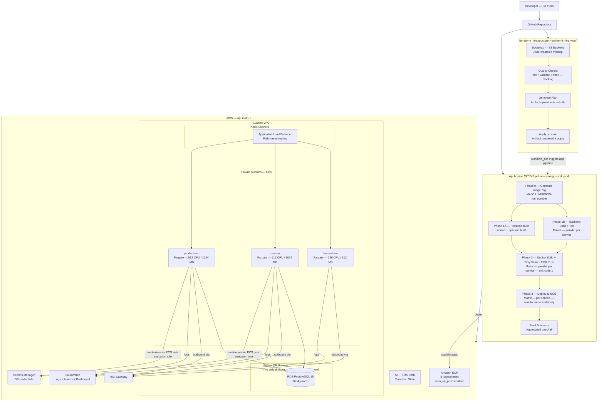

# Cloud-Native Infrastructure Automation & Containerized Deployment on AWS

**GitHub Actions · Terraform · Docker · AWS ECS Fargate · tfsec · Trivy · Gitleaks**

> A complete cloud-native platform on AWS for a containerized three-service application on Amazon ECS Fargate — focusing on infrastructure design, CI/CD automation, DevSecOps integration, and operational observability.

---

## Table of Contents

- [What this project demonstrates](#what-this-project-demonstrates)
- [Tech stack](#tech-stack)
- [Architecture](#architecture)
  - [High-level architecture diagram](#high-level-architecture-diagram)
  - [Infrastructure layers](#infrastructure-layers)
  - [Networking and security design](#networking-and-security-design)
- [CI/CD pipelines](#cicd-pipelines)
  - [Application pipeline (catalogix-cicd.yaml)](#application-pipeline-catalogix-cicdyaml)
  - [Infrastructure pipeline (tf-infra.yaml)](#infrastructure-pipeline-tf-infrayaml)
- [Infrastructure design decisions](#infrastructure-design-decisions)
- [Secrets management](#secrets-management)
- [Observability](#observability)
- [Repository structure](#repository-structure)
- [How to run](#how-to-run)
- [Design decisions and trade-offs](#design-decisions-and-trade-offs)
- [Known limitations and future improvements](#known-limitations-and-future-improvements)

---

## What this project demonstrates

The application — *Catalogix*, a product catalog with user management — is intentionally simple so it does not distract from what is actually being demonstrated.

What is being demonstrated:

- **Infrastructure as code** — complete AWS environment provisioned by flat Terraform files; no manual console configuration anywhere
- **Secure CI/CD with GitHub Actions** — matrix builds run services in parallel; Trivy scans every image before it touches ECR; Gitleaks runs on every push; the pipeline does not report success until ECS confirms the new task is healthy
- **Production-aligned ECS Fargate networking** — three distinct subnet tiers; RDS subnet has no default route (isolated at the routing table level, not just the security group level); ECS tasks are not publicly accessible
- **Secrets without credentials in code** — DB credentials injected at container startup by the ECS agent via Secrets Manager; no secret is stored in the pipeline, in environment files, or in Terraform state as plaintext
- **Observability as code** — all CloudWatch log groups, alarms (9 total), and the metrics dashboard are provisioned by Terraform; no manual console setup
- **Pipeline chaining** — the app pipeline triggers automatically after the infra pipeline completes successfully via `workflow_run`, ensuring infrastructure changes land before application deployments

---

## Tech stack

| Category | Tools |
|---|---|
| Cloud | AWS (ECS Fargate, RDS PostgreSQL, ECR, ALB, Secrets Manager, CloudWatch, IAM) |
| IaC | Terraform (flat files, no modules — intentional) |
| CI/CD | GitHub Actions (matrix jobs, composite actions, pipeline chaining) |
| Containerisation | Docker (multi-stage builds) |
| Security scanning | Trivy (images — CRITICAL/HIGH, exit-code 1), tfsec (IaC — blocking), Gitleaks (secrets) |
| Secrets | AWS Secrets Manager + ECS task execution role |
| Monitoring | CloudWatch (logs, CPU/memory/ALB alarms, metrics dashboard) |
| Application | Spring Boot (user-svc :8081, product-svc :8082), React + Nginx (frontend-svc :80) |
| Database | PostgreSQL 15 on Amazon RDS |

---

## Architecture

### High-level architecture diagram

> The diagram below renders on GitHub. A static image is also available at `docs/architecture.png`.



### Request flow

```
Client
  ↓
Application Load Balancer  (public subnets)
  ↓  path-based rules
ECS Fargate Services — frontend / user-svc / product-svc  (private ECS subnets)
  ↓
Amazon RDS PostgreSQL  (private DB subnets — no default route)
```

### Infrastructure layers

```
terraform/
├── terraform-backend/          # S3 + KMS CMK — apply once before main infra
│                               # S3: versioned, force_destroy=false, all public access blocked
│                               # KMS: CMK for SSE (you control the key, not AWS)
└── envs/dev/                   # Development environment — flat Terraform, no modules
    ├── networking.tf           # VPC, 3 subnet tiers, IGW, NAT Gateway, route tables
    ├── security-groups.tf      # ALB SG, ECS SG, RDS SG (port 5432 from ECS SG only)
    ├── alb.tf                  # ALB, HTTP listener, path-based listener rules, target groups
    ├── ecs.tf                  # ECS cluster, task definitions (secrets block), services
    ├── ecr.tf                  # ECR repos, scan_on_push, lifecycle policy (last 10 images)
    ├── rds.tf                  # RDS PostgreSQL 15, encrypted, no public access
    ├── secrets.tf              # Secrets Manager secret for DB credentials
    ├── iam.tf                  # ECS execution role (GetSecretValue scoped), ECS task role
    ├── cloudwatch.tf           # Log groups, CPU/mem/ALB alarms (for_each), dashboard
    ├── autoscaling.tf          # App autoscaling — CPU + memory target tracking per service
    ├── outputs.tf
    ├── variables.tf
    └── providers.tf
```

Terraform modules were intentionally avoided to keep all resource relationships explicit and visible in one place. A change to the ECS task definition is in `ecs.tf`, its security group is in `security-groups.tf`, its IAM role is in `iam.tf` — nothing is hidden inside a module.

### Networking and security design

Three distinct subnet tiers in the VPC, each with separate routing:

**Public subnets** — ALB lives here. Internet Gateway provides inbound access. `map_public_ip_on_launch = true` for the ALB.

**Private ECS subnets** — Fargate tasks run here. NAT Gateway provides outbound access for ECR image pulls and Secrets Manager calls. ECS tasks have `assign_public_ip = false`.

**Private RDS subnets** — RDS lives here with its own route table that has **no default route** — not even to the NAT Gateway. The only path into this subnet is via the RDS security group rule allowing port 5432 from the ECS security group. Restricting routing at the subnet level is an additional isolation layer beyond the security group alone.

Subnet CIDRs are computed dynamically with `cidrsubnet(var.vpc_cidr, 4, index)`:
- Public subnets: offsets 0–1
- ECS private subnets: offsets 4–5
- RDS private subnets: offsets 8–9

Security controls summary:

| Control | Where | Notes |
|---|---|---|
| Secrets never in code | ECS `secrets` block → Secrets Manager | ECS agent injects at startup; no human ever handles the value |
| RDS not publicly accessible | Terraform + routing table | No default route in RDS subnet; SG port 5432 from ECS SG only |
| ECS not publicly accessible | `assign_public_ip = false` | Only reachable via ALB |
| Image vulnerability scanning | Trivy (pre-push, blocking) + ECR `scan_on_push` | Two independent layers |
| IaC security scanning | tfsec — `soft_fail: false` | Any finding fails the pipeline |
| Secret scanning | Gitleaks on every push | Runs before build |
| Terraform state encryption | KMS CMK (Customer Managed Key) | Key usage logged to CloudTrail |
| State bucket protection | `force_destroy = false` | Cannot be deleted by Terraform accidentally |

---

## CI/CD Pipelines

### Application pipeline (`catalogix-cicd.yaml`)

**Trigger logic:**
- `push` to `main` — path filters: only `user-svc/`, `product-svc/`, `frontend-svc/`, `pom.xml`, or the workflow file itself
- `workflow_run` — triggers automatically after the Terraform Infrastructure pipeline completes successfully on `main`
- `workflow_dispatch` — manual trigger

`concurrency: group: catalogix-main, cancel-in-progress: true` — if a new commit arrives while a pipeline is running, the in-progress run is cancelled and only the latest commit is deployed.

```
Phase 0 — Pipeline Context
  └── Generate image tag: MAJOR_VERSION-github.run_number (once, shared by all downstream jobs)

Phase 1A — Frontend Build
  └── npm ci + npm run build (Node.js 22, npm cache keyed to package-lock.json)

Phase 1B — Backend Build + Test  (matrix: user-svc, product-svc — parallel)
  └── mvn install -N (parent POM)
  └── mvn clean verify (unit + integration tests per service)

Phase 2 — Docker Build + Trivy Scan + ECR Push  (matrix: all 3 services — parallel)
  └── docker build --pull --cache-from ECR --build-arg BUILDKIT_INLINE_CACHE=1
  └── Trivy image scan — CRITICAL,HIGH — ignore-unfixed — exit-code 1
  └── docker push (only if Trivy passes)

Phase 3 — Deploy to ECS  (matrix: all 3 services — parallel)
  └── Download current task definition from ECS
  └── Render new task definition with updated image tag
  └── Deploy + wait-for-service-stability (pipeline does not succeed until ECS confirms healthy)

Final Summary  (always runs)
  └── Aggregated pass/fail — exits non-zero if any matrix job failed
```

**Key pipeline decisions:**

**Matrix jobs for homogeneous service operations.** Phases 1B, 2, and 3 all use `strategy.matrix`. Adding a fourth service requires one entry in the matrix — no pipeline duplication. `fail-fast: true` cancels sibling builds immediately if one fails.

**Build cache from ECR.** `--cache-from` pointing to an existing ECR cache layer with `BUILDKIT_INLINE_CACHE=1` reuses unchanged layers from ECR on subsequent builds, reducing build time significantly for Maven dependency resolution.

**Trivy runs before ECR push — not after.** If a CRITICAL or HIGH unfixed vulnerability is found, the image is never pushed. ECR `scan_on_push` is also enabled as an ongoing secondary check for CVEs disclosed after the original build.

**Image tag generated once in Phase 0.** A single `context` job generates the tag and all downstream jobs reference it. If each job generated its own tag, different phases could produce different tags for the same commit.

**`wait-for-service-stability: true`.** The pipeline does not report success until ECS confirms the new task definition is running and healthy targets exist in the ALB target group.

**Pipeline chaining via `workflow_run`.** Infrastructure changes are applied first; the application deploys automatically on the same commit. Without this, an infra change and an app change could deploy the app before infra was ready.

### Infrastructure pipeline (`tf-infra.yaml`)

```
Bootstrap
  └── Check if S3 backend bucket exists (aws s3api head-bucket)
  └── If missing: terraform init + terraform apply in terraform-backend/
  └── S3: force_destroy=false, versioning enabled, SSE with Customer Managed KMS key

Quality Checks
  └── terraform fmt -check -recursive    (fails if any file is not formatted)
  └── terraform validate
  └── tfsec — soft_fail: false           (any finding fails the pipeline)

Plan
  └── terraform plan -out main.tfplan
  └── Upload artifact: main.tfplan + .terraform.lock.hcl

Deploy  (main branch only)
  └── Download artifact
  └── terraform init -input=false
  └── terraform apply --auto-approve main.tfplan
```

`concurrency: group: terraform-dev` ensures two infra runs never execute simultaneously.

**Composite action** (`terraform-setup/action.yaml`) is called by every Terraform pipeline job to configure AWS credentials and set up Terraform. It accepts an `enable_terraform` flag (default: `true`) so jobs that need only AWS credentials — not Terraform — can set `enable_terraform: false` without duplicating the AWS credentials setup.

**Destroy workflow** (`tf-destroy.yaml`) is triggered only by `workflow_dispatch` (manual). Destroying infrastructure always requires a deliberate manual action in the GitHub UI — it is never triggered by a push.

---

## Infrastructure Design

### ECS task definitions (`ecs.tf`)

| Service | CPU | Memory | Port |
|---|---|---|---|
| frontend-svc | 256 | 512 MB | 80 |
| user-svc | 512 | 1024 MB | 8081 |
| product-svc | 512 | 1024 MB | 8082 |

Backend services receive DB credentials via the ECS `secrets` block — not environment variables. The `valueFrom` field references the Secrets Manager secret ARN directly. The ECS agent injects the values at container startup.

All three ECS services have `lifecycle { ignore_changes = [task_definition, desired_count] }`. Without this, every `terraform apply` after the first deployment would try to revert the running task definition to the original `init` image tag. The CI/CD pipeline owns the task definition after initial provisioning.

`health_check_grace_period_seconds = 90` on backend services covers JVM startup + Spring context initialization. Without this, ECS registers the task with the ALB before the application is ready, health checks fail, and ECS kills and restarts the task in a loop.

CloudWatch log driver uses `mode = "non-blocking"` with `max-buffer-size = "25m"`. In blocking mode, if CloudWatch Logs is temporarily unavailable, the container's logging calls block and can cause the application to hang.

### ALB and path-based routing (`alb.tf`)

A single ALB routes to all three services using listener rule priorities:
- Priority 10: `/users*` and `/users/*` → user-svc target group (port 8081)
- Priority 20: `/products*` and `/products/*` → product-svc target group (port 8082)
- Default: all other traffic → frontend-svc target group (port 80)

Target type is `ip` (required for Fargate — Fargate tasks do not use EC2 instance IDs).

Both backend target groups have `lifecycle { create_before_destroy = true }` to prevent downtime during target group replacements.

### Autoscaling (`autoscaling.tf`)

All three services and their autoscaling configurations are defined in a single `local` map (`autoscaling_config`). The `aws_appautoscaling_target` and `aws_appautoscaling_policy` resources use `for_each` over this map. Adding autoscaling for a new service requires one entry in the map.

| Setting | Value |
|---|---|
| CPU target | 70% |
| Memory target | 75% |
| Minimum tasks | 1 per service |
| Maximum tasks | 2 per service |
| Scale-out cooldown | 60s |
| Scale-in cooldown | 300s |

### CloudWatch monitoring (`cloudwatch.tf`)

All 9 alarms (3 CPU + 3 memory + 3 ALB unhealthy-host) are generated from 2 `resource` blocks using `for_each` — not 9 separate resource definitions. The CloudWatch dashboard (8 widgets) is provisioned and updated by `terraform apply`.

---

## Secrets Management

DB credentials are stored in AWS Secrets Manager. No secret is in source code, environment files, or in a CI/CD credential store.

**Flow:**

1. Terraform creates the Secrets Manager secret and stores DB credentials at `${project_name}/database-credentials`
2. The ECS task execution role has an inline policy granting `secretsmanager:GetSecretValue` scoped to only this secret ARN
3. At container startup, the ECS agent reads the secret and injects the values as environment variables via the `secrets` block in the task definition
4. The application reads standard `SPRING_DATASOURCE_USERNAME` / `SPRING_DATASOURCE_PASSWORD` environment variables — no code change needed if the secret rotates

`recovery_window_in_days = 0` is set so the secret is deleted immediately on `terraform destroy` rather than being held for 30 days — appropriate for a dev environment where re-provisioning is expected.

---

## Observability

CloudWatch provides centralized observability across all services. Everything is provisioned by Terraform — no manual console configuration.

| Component | Details |
|---|---|
| Log groups | Per-service, 7-day retention |
| ECS CPU alarms | Per service — triggers above 80% over 2 consecutive 60s periods |
| ECS memory alarms | Same threshold and evaluation window |
| ALB unhealthy-host alarms | Triggers when any target group reports 1+ unhealthy hosts |
| Dashboard | 8 widgets — CPU/memory for backend services, ALB request count, response time, 5XX count, unhealthy hosts |

---

## Repository Structure

```
aws-ecs-fargate-iac/
│
├── .github/
│   ├── workflows/
│   │   ├── catalogix-cicd.yaml     # Application CI/CD — matrix build, scan, deploy
│   │   ├── tf-infra.yaml           # Infrastructure pipeline — bootstrap, quality, plan, apply
│   │   └── tf-destroy.yaml         # Manual-only destroy workflow (workflow_dispatch only)
│   └── actions/
│       └── terraform-setup/
│           └── action.yaml         # Composite action — AWS credentials + Terraform setup
│
├── user-svc/                       # Spring Boot user management service (port 8081)
│   ├── src/
│   └── Dockerfile
│
├── product-svc/                    # Spring Boot product catalog service (port 8082)
│   ├── src/
│   └── Dockerfile
│
├── frontend-svc/                   # React + Nginx frontend (port 80)
│   ├── src/
│   └── Dockerfile
│
├── terraform/
│   ├── terraform-backend/          # S3 + KMS CMK — apply once before main infra
│   └── envs/dev/                   # Development environment — flat files, no modules
│       ├── networking.tf           # VPC, 3 subnet tiers, IGW, NAT, route tables
│       ├── security-groups.tf      # ALB SG, ECS SG, RDS SG
│       ├── alb.tf                  # ALB, HTTP listener, path-based listener rules
│       ├── ecs.tf                  # ECS cluster, task definitions, services
│       ├── ecr.tf                  # ECR repositories, scan_on_push, lifecycle policy
│       ├── rds.tf                  # RDS PostgreSQL 15, db.t4g.micro, encrypted
│       ├── secrets.tf              # Secrets Manager secret for DB credentials
│       ├── iam.tf                  # ECS execution role, ECS task role
│       ├── cloudwatch.tf           # Log groups, alarms (for_each), dashboard
│       ├── autoscaling.tf          # App autoscaling — CPU + memory target tracking
│       ├── outputs.tf
│       ├── variables.tf
│       └── providers.tf
│
└── pom.xml                         # Maven parent POM — multi-module build coordination
```

---

## How to Run

### Prerequisites

- AWS account (ap-south-1 by default — change `AWS_REGION` in both workflow files)
- Terraform >= 1.14.0
- AWS CLI configured with IAM credentials that have sufficient permissions
- GitHub repository with the required secrets and variables configured (see below)

### Required GitHub Secrets

| Secret | Description |
|---|---|
| `AWS_ACCESS_KEY_ID` | IAM user access key |
| `AWS_SECRET_ACCESS_KEY` | IAM user secret key |
| `DB_USERNAME` | RDS master username |
| `DB_PASSWORD` | RDS master password |

> **Note:** These use long-lived IAM user credentials. Migrating to GitHub OIDC (OpenID Connect) with an IAM role is planned as the next improvement — it removes all long-lived access keys. See [Future Improvements](#known-limitations-and-future-improvements).

### Required GitHub Variables

| Variable | Description |
|---|---|
| `PROJECT_NAME` | Project name prefix for all AWS resources |
| `VPC_CIDR` | VPC CIDR block (e.g. `10.0.0.0/16`) |
| `PUBLIC_SUBNET_CIDRS` | Public subnet CIDR list (JSON array) |
| `PRIVATE_SUBNET_CIDRS` | Private subnet CIDR list (JSON array) |

### Step 1 — Provision Infrastructure

Push a change to any file under `terraform/` to the `main` branch. The `tf-infra.yaml` pipeline runs automatically:

1. Creates the S3 + KMS Terraform state backend if it does not exist
2. Runs `terraform fmt`, `terraform validate`, and `tfsec` (blocking)
3. Generates a plan and uploads it as an artifact
4. Applies the plan on `main`

Or run manually from the GitHub Actions UI (workflow_dispatch).

### Step 2 — Deploy the Application

The application pipeline (`catalogix-cicd.yaml`) triggers automatically after the infrastructure pipeline completes on `main`. You can also trigger it manually or by pushing a change to any service directory.

### Step 3 — Destroy Infrastructure

Trigger `tf-destroy.yaml` manually from the GitHub Actions UI. Destroying infrastructure requires a deliberate manual action — it cannot be triggered by a push.

---

## Design Decisions and Trade-offs

### 1. ECS Fargate over EC2 / EKS

Fargate removes node management entirely. No AMI lifecycle, no node patching, no cluster upgrade maintenance window. For a DevOps-focused project demonstrating AWS-native design, Fargate offers the best balance between operational simplicity and production realism.

**Trade-off:** Less control over underlying compute. Vendor lock-in compared to Kubernetes. No fine-grained scheduling constraints.

### 2. Single ALB with path-based routing over per-service ALBs

One ALB routes traffic to all three services using listener rule priorities. Cost-efficient and simple to reason about request flow.

**Trade-off:** Shared blast radius if the ALB is misconfigured. Less isolation than per-service ALBs.

### 3. Matrix-based CI/CD

GitHub Actions matrix jobs run build, scan, and deploy for all services in parallel. Adding a fourth service requires one entry in the matrix — no pipeline duplication. `fail-fast: true` cancels sibling jobs immediately if one fails.

**Trade-off:** Aggregated job status requires careful handling (the Final Summary job collects results across all matrix jobs).

### 4. Terraform without modules (intentional)

All resource relationships are visible in one place. A reviewer can trace a complete flow — task definition in `ecs.tf`, its security group in `security-groups.tf`, its IAM role in `iam.tf` — without navigating module boundaries.

**Trade-off:** Less DRY. Does not scale well if this platform were extended to 10+ environments or services.

### 5. `lifecycle { ignore_changes = [task_definition] }` on ECS services

After initial provisioning, the CI/CD pipeline owns the task definition revision. Without this, every `terraform apply` would try to revert the running task definition to the `init` image tag hardcoded at resource creation time.

### 6. ECR `scan_on_push` alongside pipeline Trivy

Trivy runs before the push and blocks delivery of vulnerable images. ECR's scan runs after the push using AWS's managed scanning infrastructure. The ECR scan acts as an ongoing check against CVEs disclosed after the image was originally built — two independent scanning layers with different purposes.

### 7. RDS subnet routing isolation

The RDS private subnets have their own route table with no default route — not even to the NAT Gateway. This is an additional isolation layer beyond the security group rule that allows only port 5432 from the ECS security group. If the security group were ever misconfigured, the routing table provides a second line of defence.

---

## Known Limitations and Future Improvements

| Limitation | Status / Planned fix |
|---|---|
| Static IAM credentials | Replace with GitHub OIDC — IAM role assumed via OIDC token, no long-lived access keys. `permissions: id-token: write` is already set in both workflow files. |
| HTTP only | Add ACM certificate + HTTPS listener — exact annotations are documented in `alb.tf` comments |
| Single NAT Gateway | One NAT Gateway per AZ for production multi-AZ HA |
| `skip_final_snapshot = true` on RDS | Change to `false` in any environment where data loss is unacceptable |
| `deletion_protection = false` on RDS | Enable in staging and production |
| No Gitleaks in app pipeline | Currently in the companion Jenkins project. Future addition noted. |
| No SonarQube / SonarCloud | `pull-requests: write` permission is already in place for future SonarCloud PR comments |
| Terraform modules | Flat files are intentional for readability; modules will be introduced for multi-environment scale |
| Single environment (dev only) | `envs/staging/` and `envs/prod/` directory structure is planned |